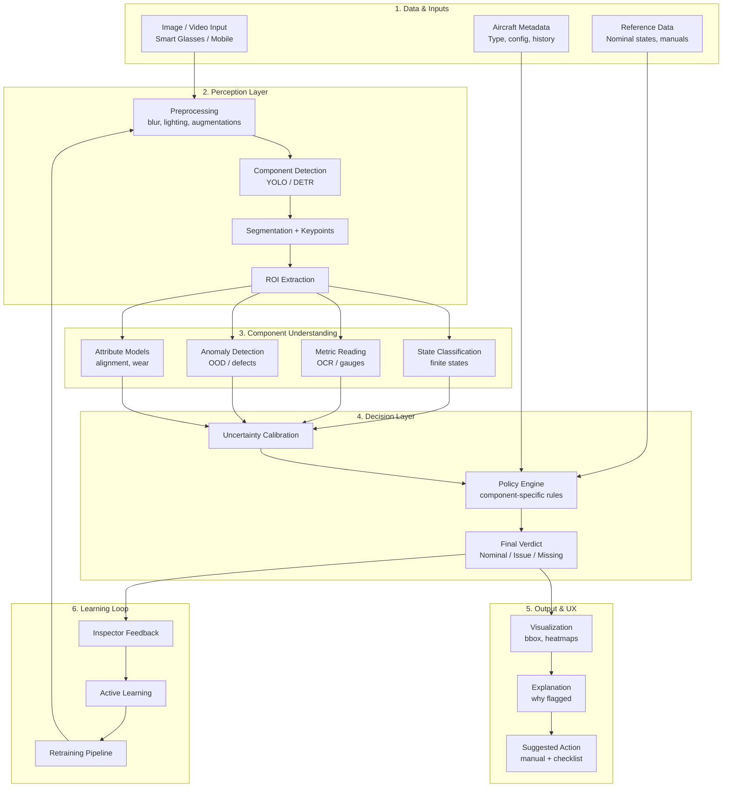

# Aircraft Inspection System (Rebuild Demo)

A reconstructed demo of a computer vision-based aircraft inspection system, originally developed as part of SkyGlass Technologies Inc.

## Overview

This project is a high-level rebuild of a previously developed aircraft inspection system.

The original system used computer vision to detect structural defects in aircraft imagery. Due to proprietary constraints, model weights and production code are not included. This repository reconstructs the core architecture and user workflow for demonstration purposes.

---

## System Concept

The system is designed to assist aircraft inspection workflows by identifying potential defects in imagery and surfacing them to an operator.

At a high level:
- Aircraft images are analyzed for structural anomalies
- Detected regions are highlighted visually
- The interface provides context to guide inspection and follow-up actions

This rebuild focuses on recreating that interaction loop:  
**detection → visualization → inspection decision support**

---

## Motivation

Manual aircraft inspection is time-intensive and requires careful attention to small structural details.

This project explores how computer vision can assist inspectors by highlighting areas of interest and streamlining the inspection process.

---

## Diagram


## Original System Design

The original system was designed as a multi-stage aircraft inspection pipeline:

1. **Data & Inputs**
   - Aircraft imagery (mobile / inspection devices)
   - Aircraft metadata (configuration, history)
   - Reference data (manuals, expected states)

2. **Perception Layer**
   - Image preprocessing (lighting, noise normalization)
   - Component detection (e.g., YOLO-based models)
   - Segmentation and keypoint extraction
   - Region-of-interest (ROI) extraction

3. **Component Understanding**
   - Attribute analysis (alignment, wear)
   - Anomaly detection (defects, out-of-distribution signals)
   - Metric reading (e.g., gauges via OCR)
   - State classification (finite-state component conditions)

4. **Decision Layer**
   - Uncertainty calibration across model outputs
   - Policy engine combining rules + model signals
   - Final verdict generation (nominal / issue / missing)

5. **Output & UX**
   - Visual overlays (bounding boxes, heatmaps)
   - Explanations for flagged regions
   - Suggested inspection actions

6. **Learning Loop**
   - Inspector feedback
   - Active learning
   - Retraining pipeline


## Relation to This Demo

This repository reconstructs a simplified version of the original system:

- The **Perception Layer** is simulated using precomputed YOLO-format labels
- The **Output & UX layer** is implemented via the React interface
- The **Decision layer** is represented through inspection notes and detection summaries

More advanced components (e.g., anomaly detection, policy engine, learning loop) are not included, but the architecture is designed to support them.

## Architecture

**Frontend (React)**
- Image selection and inspection interface
- Bounding box overlay rendering
- Inspection notes panel

**Backend (FastAPI)**
- `/api/detect` endpoint
- Service layer abstraction for detection logic
- YOLO-format label parsing utilities

**Data Flow**

Image → API request → Detection service → Parsed results → UI overlay

---

## Features

- Visual defect localization using bounding boxes
- Interactive inspection interface for reviewing detections
- Contextual inspection notes tied to inspection scenarios
- Normalized coordinate → pixel rendering for overlays
- Modular backend design for integrating real ML models

---

## Model Framework

The system includes an abstraction layer for perception models.

- Base model interfaces define a consistent prediction API
- Detection models are structured to return YOLO-style outputs
- A mock detector is used in this demo to simulate inference using label files

This design allows the system to be extended with real models (e.g., YOLO, DETR) without modifying the API or frontend.

## Tech Stack

**Frontend**
- React

**Backend**
- FastAPI
- Pydantic

**Other**
- YOLO annotation format (simulated inference)

---

## Getting Started

## Running with Docker

```bash
docker-compose up --build

Frontend: http://localhost:5173

Backend: http://localhost:8000

### Backend

```bash
cd backend
uvicorn app.main:app --reload

### Frontend
cd frontend
npm install
npm run dev
