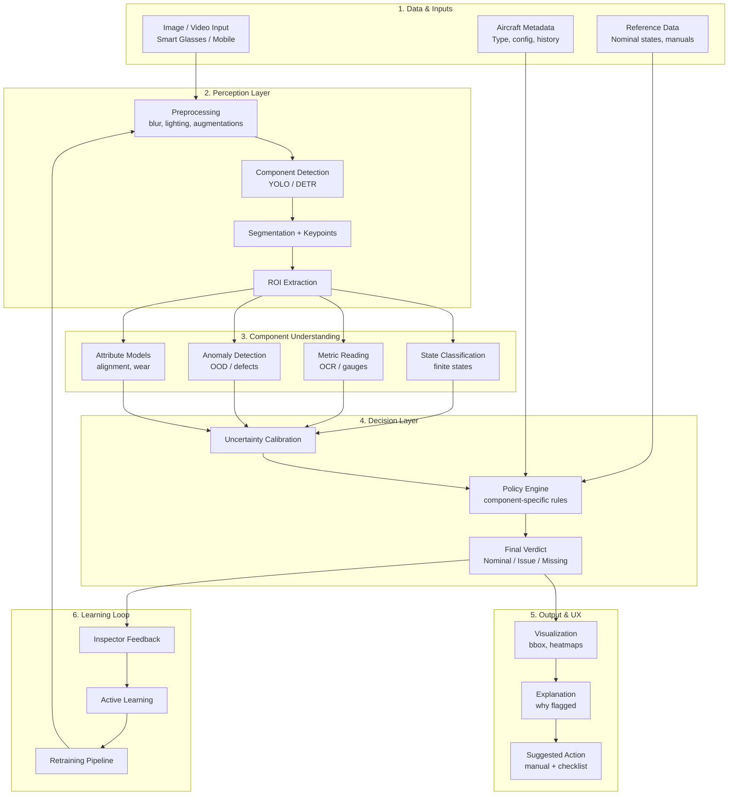

# SkyGlass – Aircraft Inspection System (Startup Project)

SkyGlass was a computer vision startup focused on automating aircraft inspection workflows using real-world imagery and defect detection models.

- **Stage:** MVP with real-world pilot testing  
- **Users:** General aviation pilots and flight centers  
- **Team:** 4 engineers + 1 pilot  
- **My Role:** Led system design and built the end-to-end ML pipeline (data ingestion → model inference → inspection feedback loop)

This repository is a **reconstructed demo** of the original system architecture and interaction loop.  
Production code, models, and datasets are not included due to proprietary constraints.

---

## Impact

- Trained on ~12K labeled aircraft images across multiple defect classes  
- Achieved ~0.73 mAP@0.5 on detection tasks  
- Reduced inspection time by ~18% during pilot testing  
- Evaluated with real aviation operators in live inspection workflows  

---

## Key Technical Work

- Designed the image ingestion and preprocessing pipeline for field-captured aircraft data  
- Built defect detection workflows using computer vision models under noisy, real-world conditions  
- Developed the feedback loop between model outputs and user inspection decisions  
- Handled challenges including lighting variability, limited labeled data, and deployment constraints  

---

## Outcome

The system reached MVP stage and was tested in real-world pilot environments.

The project was not taken to full production due to regulatory and safety constraints (e.g., FAA compliance requirements for safety-critical inspection systems).

**Key learnings:**
- Designing ML systems requires tight integration between model outputs and user workflows  
- Real-world data quality and distribution shift are primary bottlenecks, not model architecture  
- Deployment in safety-critical domains introduces regulatory and validation challenges beyond model performance  

---

## System Concept

The system is designed to assist aircraft inspection workflows by identifying potential defects in imagery and surfacing them to an operator.

At a high level:
- Aircraft images are analyzed for structural anomalies
- Detected regions are highlighted visually
- The interface provides context to guide inspection and follow-up actions

This rebuild focuses on recreating that interaction loop:  
**detection → visualization → inspection decision support**

---

## Motivation
Aircraft inspection is a safety-critical, time-intensive process requiring precise identification of small structural defects. This system was designed to assist real-world inspection workflows by highlighting high-risk regions, reducing cognitive load on inspectors, and accelerating inspection time.**

---

## Why This Project Matters

This project demonstrates:
- End-to-end ML system design (data → model → decision → UX)
- Real-world deployment considerations (latency, usability, uncertainty)
- Modular architecture for extending perception models into production systems

## Diagram

## Original System Design

The original system was designed as a multi-stage aircraft inspection pipeline:

1. **Data & Inputs**
   - Aircraft imagery (mobile / inspection devices)
   - Aircraft metadata (configuration, history)
   - Reference data (manuals, expected states)

2. **Perception Layer**
   - Image preprocessing (lighting, noise normalization)
   - Component detection (e.g., YOLO-based models)
   - Segmentation and keypoint extraction
   - Region-of-interest (ROI) extraction

3. **Component Understanding**
   - Attribute analysis (alignment, wear)
   - Anomaly detection (defects, out-of-distribution signals)
   - Metric reading (e.g., gauges via OCR)
   - State classification (finite-state component conditions)

4. **Decision Layer**
   - Uncertainty calibration across model outputs
   - Policy engine combining rules + model signals
   - Final verdict generation (nominal / issue / missing)

5. **Output & UX**
   - Visual overlays (bounding boxes, heatmaps)
   - Explanations for flagged regions
   - Suggested inspection actions

6. **Learning Loop**
   - Inspector feedback
   - Active learning
   - Retraining pipeline

## Relation to This Demo

This repository reconstructs a simplified version of the original system:

- The **Perception Layer** is simulated using precomputed YOLO-format labels
- The **Output & UX layer** is implemented via the React interface
- The **Decision layer** is represented through inspection notes and detection summaries

More advanced components (e.g., anomaly detection, policy engine, learning loop) are not included, but the architecture is designed to support them.

## Architecture

**Frontend (React)**
- Image selection and inspection interface
- Bounding box overlay rendering
- Inspection notes panel

**Backend (FastAPI)**
- `/api/detect` endpoint
- Service layer abstraction for detection logic
- YOLO-format label parsing utilities

**Data Flow**

1. Inspection imagery is selected through the frontend interface.
2. The client issues a detection request to the backend API with the target image reference.
3. The API passes the request through a service layer that abstracts perception logic from transport and presentation concerns.
4. The detection module retrieves simulated inference outputs from YOLO-format label files, mimicking the behavior of a production object detection model.
5. Parsed detections are normalized into a consistent response schema containing defect classes, confidence-style metadata, and bounding box coordinates.
6. The response is returned to the frontend, where normalized coordinates are transformed into image-space overlays.
7. The interface renders annotated defect regions alongside contextual inspection notes and review controls.
8. The resulting workflow recreates the core operator loop of the original system: perception, visualization, and inspection decision support.

---

## Features

- Visual defect localization using bounding boxes
- Interactive inspection interface for reviewing detections
- Contextual inspection notes tied to inspection scenarios
- Normalized coordinate → pixel rendering for overlays
- Modular backend design for integrating real ML models

---

## Model Framework

The system includes an abstraction layer for perception models.

- Base model interfaces define a consistent prediction API
- Detection models are structured to return YOLO-style outputs
- A mock detector is used in this demo to simulate inference using label files

This design allows the system to be extended with real models (e.g., YOLO, DETR) without modifying the API or frontend.

## Tech Stack

**Frontend**
- React

**Backend**
- FastAPI
- Pydantic

**Other**
- YOLO annotation format (simulated inference)
