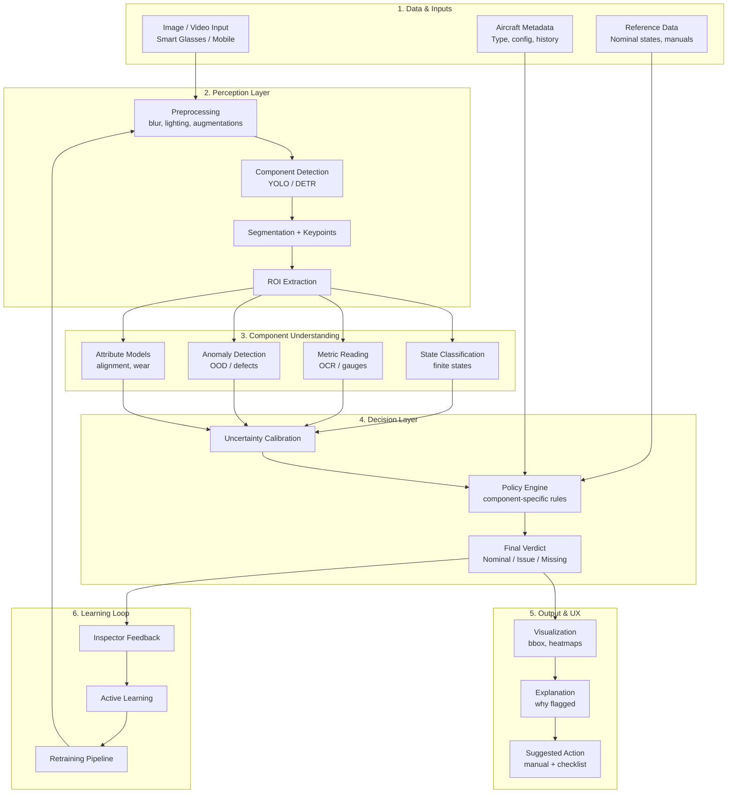

```mermaid
flowchart TB

%% =========================
%% 1. INPUT + DATA
%% =========================
subgraph A[1. Data & Inputs]
  A1[Image / Video Input<br/>Smart Glasses / Mobile]
  A2[Aircraft Metadata<br/>Type, config, history]
  A3[Reference Data<br/>Nominal states, manuals]
end

%% =========================
%% 2. PERCEPTION (VISION)
%% =========================
subgraph B[2. Perception Layer]
  B1[Preprocessing<br/>blur, lighting, augmentations]
  B2[Component Detection<br/>YOLO / DETR]
  B3[Segmentation + Keypoints]
  B4[ROI Extraction]
end

%% =========================
%% 3. UNDERSTANDING (ML)
%% =========================
subgraph C[3. Component Understanding]
  C1[State Classification<br/>finite states]
  C2[Metric Reading<br/>OCR / gauges]
  C3[Anomaly Detection<br/>OOD / defects]
  C4[Attribute Models<br/>alignment, wear]
end

%% =========================
%% 4. DECISION + LOGIC
%% =========================
subgraph D[4. Decision Layer]
  D1[Uncertainty Calibration]
  D2[Policy Engine<br/>component-specific rules]
  D3[Final Verdict<br/>Nominal / Issue / Missing]
end

%% =========================
%% 5. OUTPUT
%% =========================
subgraph E[5. Output & UX]
  E1[Visualization<br/>bbox, heatmaps]
  E2[Explanation<br/>why flagged]
  E3[Suggested Action<br/>manual + checklist]
end

%% =========================
%% 6. FEEDBACK LOOP
%% =========================
subgraph F[6. Learning Loop]
  F1[Inspector Feedback]
  F2[Active Learning]
  F3[Retraining Pipeline]
end

%% =========================
%% FLOW
%% =========================
A1 --> B1 --> B2 --> B3 --> B4

B4 --> C1
B4 --> C2
B4 --> C3
B4 --> C4

C1 --> D1
C2 --> D1
C3 --> D1
C4 --> D1

D1 --> D2
A2 --> D2
A3 --> D2

D2 --> D3 --> E1 --> E2 --> E3

D3 --> F1 --> F2 --> F3 --> B1
```